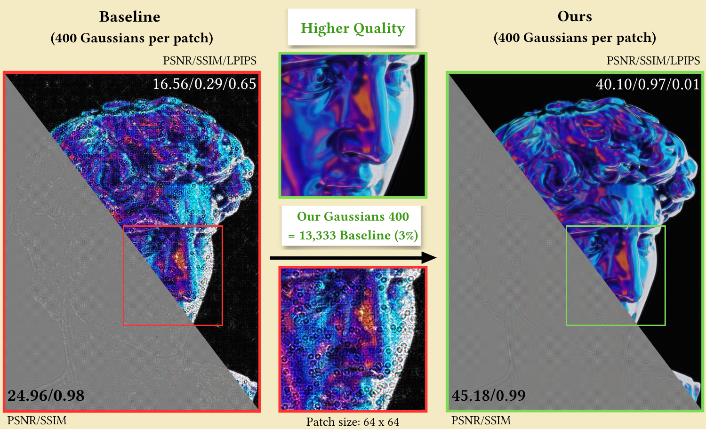

<div align="center">
# Compressing Double-Phase Holograms using 2D Gaussians
 
Xiaoyue Fan, [Yicheng Zhan](https://albertgary.github.io/), [Amrita Mazumdar](https://amritamaz.net/), [Kaan Akşit](https://www.kaanaksit.com/)


</div>

## Getting Started

This project is based on the [gsplat](https://github.com/XingtongGe/gsplat) submodule, licensed under the MIT License.

```bash
cd Gaussgram-main
git clone https://github.com/XingtongGe/gsplat.git
cd gsplat
pip install .[dev]
cd ../
pip install -r requirements.txt
```

---

## Compressed Representation

Each bash script corresponds to a specific sample hologram. Two factorization options are available:

| Directory | Factorization |
|-----------|---------------|
| `./scripts/gaussianimage_cholesky/` | Cholesky |
| `./scripts/gaussianimage_rs/` | RS |

All sample holograms are licensed for both commercial and non-commercial use.

**Example — Police Dog hologram with patch size 64:**

```bash
# Cholesky factorization
bash scripts/gaussianimage_cholesky/dog_64.sh dataset/samplehologram

# RS factorization
bash scripts/gaussianimage_rs/dog_64.sh dataset/samplehologram
```

## Dataset Structure

The default setting crops four neighbouring patches from the sample hologram in `./dataset/samplehologram/`. After cropping, each patch and its decomposed components are sequentially numbered:

```
dataset/samplehologram/
├── patch_001    # cropped patch from sample hologram
├── patch_002    # high-value component, vertical decomposition
├── patch_003    # high-value component, horizontal decomposition
├── patch_004    # low-value component, vertical decomposition
├── patch_005    # low-value component, horizontal decomposition
├── patch_006    # next neighbouring patch
└── ...
```

---

## Output Structure

After training, results are saved under `./checkpoints/`:

```
checkpoints/
└── samplehologram/
    ├── GaussianImage_Cholesky_70000_200/
    │   ├── dog_patch_64_001/
    │   ├── dog_patch_64_002/
    │   ├── ...
    │   ├── dog_patch_64_020/
    │   ├── results/        ← compressed patches + simulated reconstructions
    │   └── stat_plots/     ← parameter changes throughout training
    ├── GaussianImage_RS_70000_200/
    └── quality_plots/      ← PSNR, SSIM vs compression ratio plots
```

> **Example:** Police Dog · patch size 64 · Cholesky · 200 Gaussians · 70 000 epochs
> `./checkpoints/samplehologram/GaussianImage_Cholesky_70000_200/results`

---

